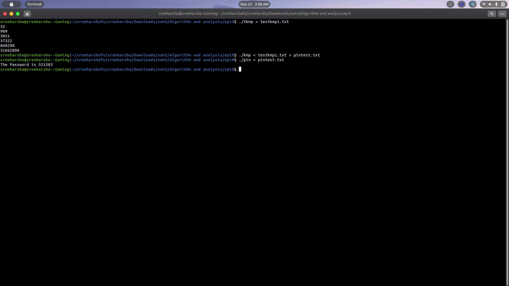

# Episode4-code
KMP Code

## Generation of a test case
1. ./tkmp > testkmp1.txt
2. ./tkmp > testkmp2.txt
3. ./tkmp > testkmp3.txt

## Running the testcase to find matches of word jeckyll
* ./kmp < testkmp3.txt > pintest.txt
the output will redirect to pintest.txt
printed the output in stderr too. to know the values,

## Finding the password
* ./pin < pintest.txt 

the following process is done for getting password.

